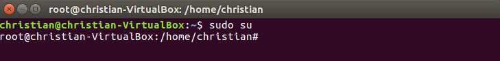
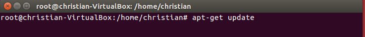
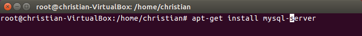
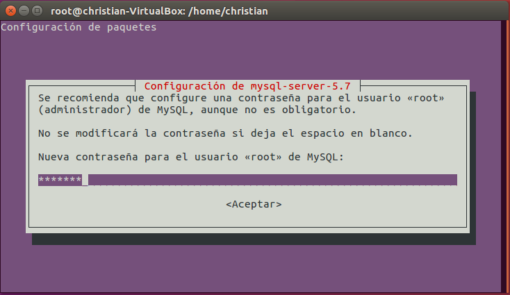
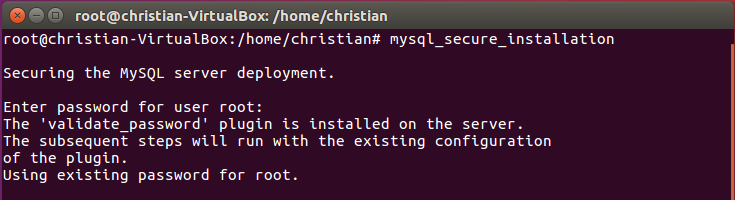
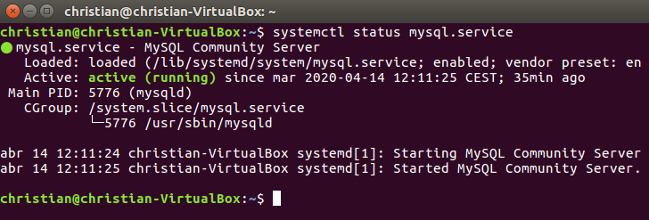

# Tarefa 2

# INSTALACIÓN MySQL

***
***
# INDICE <a name="mysql_index"></a>
1. ⚡ [Instalación MySQL](#install_mysql)
2. ⚡ [Configuración MySQL](#conf_mysql)
3. ⚡ [Comprobación MySQL](#check_mysql)
***
## Instalación <a name="install_mysql"></a>
En este documento, explicaremos paso a paso, la instalación de MySQL en Ubuntu (Terminal)

 > Antes de nada tendremos que iniciar en modo root (SuperUsuario), para ello, escribiremos el siguiente comando 👇

```console
christian@christian-VirtualBox:~$ sudo su
```


Una vez iniciados con el usuario root, teclearemos lo siguiente:

```console
root@christian-VirtualBox:/home/christian# apt-get update
```



 > Con esto actualizamos los paquetes en *Ubuntu*
 
Cuando haya terminado de actualizar los paquetes, escribiremos lo siguiente


```console
root@christian-VirtualBox:/home/christian# apt-get install mysql-server
```



Introduciremos nuestra contraseña (o bien personalizada o bien la misma que tenemos de *root*)


👁 [ÍNDICE](#mysql_index)

## Configuración <a name="conf_mysql"></a>

Ahora solamente ejecutaremos un script (script de seguridad).

 > Por defecto, la instalación de MySQL en sí, no es segura... Para protegerla, tendremos que ejecutar un script de seguridad que trae por defecto
 > También nos preguntará acerca del plugin 'VALIDATE PASSWORD', ya que se nos presentará la opción de cambiar la contraseña **root** 

```console
root@christian-VirtualBox:/home/christian# mysql_secure_installation
```



🛡 Cuando nos pida un tipo de contraseña, introduciremos '2' y la nueva contraseña (Very Strong)
 > Ahora simplemente, introduciremos 'YES' todo el rato, hasta acabar con la instalación
 > En el momento que le demos a 'YES', mySQL se hará cargo de los aspectos relacionados con los usuarios del sistema, root, guest, passwords, etc.

👁 [ÍNDICE](#mysql_index)

## Comprobación <a name="check_mysql"></a>

Y por último, para ver que el servicio arranco correctamente, introduciremos el siguiente script 👇
```console
christian@christian-VirtualBox:~$ systemctl status mysql.service
```



 > En la Tarea3y4 mostraré como crear una BBDD correctamente
 
👁 [ÍNDICE](#mysql_index)
