# Tarefa 3

                                                CREACIÓN DE UNA BASE DE DATOS (BBDD)
                                        
# DEFINICIÓN
Una base de datos es una colección organizada de información estructurada, o datos, típicamente almacenados electrónicamente en un sistema informático. Una base de datos generalmente está controlada por un sistema de gestión de bases de datos (SGBD).

Un sistema de administración de bases de datos (SGBD) es un paquete de software diseñado para definir, manipular, recuperar y administrar datos en una base de datos. Un SGBD generalmente manipula los datos en sí, el formato de datos, los nombres de campo, la estructura de registros y la estructura de archivos. También define reglas para validar y manipular estos datos.

Un SGBD libera a los usuarios de los programas de una trama para el mantenimiento de datos. Los lenguajes de consulta de cuarta generación, como SQL, se usan junto con el paquete SGBD para interactuar con una base de datos.

🛡NOTA: Acordarse que MySQL, no admite ni dominios `DOMAINS` ni valores monetarios tipo `Money`.

Algunos ejemplos de SGBD son los siguientes:

  - MySQL / MariaDB
  - SQL Server
  - Oracle
  - dBASE
  - FoxPro
  - ...
  
***
***
# ÍNDICE <a name="sql-bbdd_index"></a>
1. ⚡ [ANTES DE LA CREACIÓN](#sql_before-create)
2. ⚡ [CREACIÓN BBDD - PROYECTO DE INVESTIGACIÓN](#sql_proyecto-investigacion)
3. ⚡ [CREACIÓN BBDD - NAVES ESPACIALES](#sql_naves-espaciales)
***

## ANTES DE LA CREACIÓN (REPASO) <a name="sql_before-create"></a>
Antes de nada, revisaremos que el proceso de mysql se está ejecutando correctamente...

Para ello escribiremos el siguiente comando

```console
christian@christian-VirtualBox:~$ systemctl status mysql.service
```

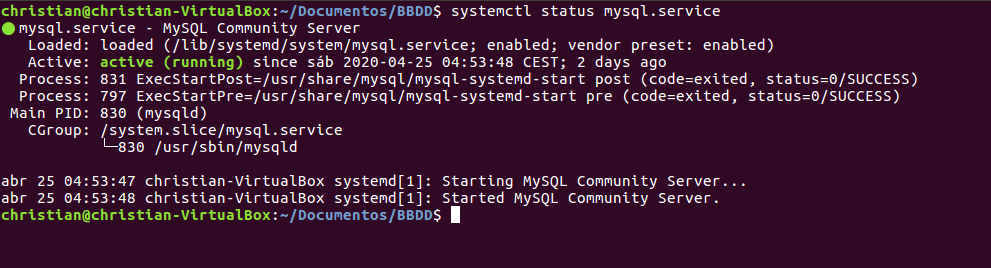
  > Podemos observar que el servicio `MySQL` se está ejecutando correctamente..
  > Systemctl no funciona con el usuario `root`

Lo que haremos ahora, será iniciar el MySQL en modo root (como ya habíamos configurado previamente en SQL_DDL) 😎

Para ello, teclearemos el siguiente comando:

```console
christian@christian-VirtualBox:~$ mysql -u root -p
```

  > Como ya hicimos la autenticación de contraseña para el usuario root, procederemos a usar dicho usuario...

👁 [ÍNDICE](#sql-bbdd_index)

Una vez iniciado con el usuario root, en la shell de MySQL, procederemos a crear una BBDD de prueba...

Para ello en MySQL, teclearemos lo siguiente

```sql
CREATE DATABASE REPASO_BBDD;
```
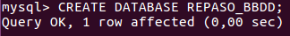
  > 🛡NOTA: En MySQL, no existe ninguna diferencia entre `CREATE SCHEMA` y `CREATE DATABASE`.
  > En otros SGBD (Ej: Oracle) si existe diferencia (Permisos...)

```sql
SHOW DATABASES;
```
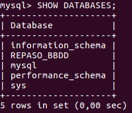

👁 [ÍNDICE](#sql-bbdd_index)

Una vez creada la BBDD anterior, procederemos a eliminarla...

Escribimos 👇

```sql
DROP DATABASE REPASO_BBDD;
```
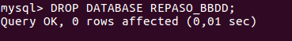
  > 🛡PELIGRO: Cuidado con la sentencia `DROP`, una vez ejecutada ya no se puede revertir...
  
Y comprobamos 🤞

```sql
SHOW DATABASES;
```
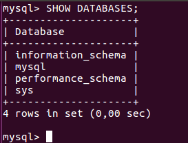

👁 [ÍNDICE](#sql-bbdd_index)

## CREACIÓN BBDD - PROYECTO DE INVESTIGACIÓN [MANUAL] <a name="sql_proyecto-investigacion"></a>

Para el ejercicio de 'Proyecto de Investigación', crearemos la BBDD paso a paso, explicando la mayor parte de cosas (en lo posible)

[CÓDIGO de *Proyecto de investigación* (GIST)](https://gist.github.com/christiancf9/cdb0675917f45ac279680d89928ffe5f)

### CREACIÓN DE LA BASE DE DATOS - (PROYECTO DE INVESTIGACIÓN)

Lo primero, antes de nada, crearemos la base de datos...

```sql
CREATE DATABASE Proyecto_de_Investigacion;
```
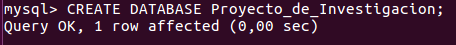

Lo siguiente será seleccionar dicha base de datos (Para ello mostraremos las disponibles) 👇

```sql
SHOW DATABASES;
```

```sql
USE Proyecto_de_Investigacion;
```

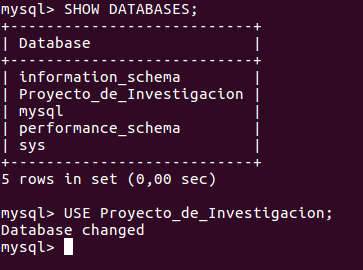

### CREACIÓN Y MODIFICACIÓN DE TABLAS - (PROYECTO DE INVESTIGACIÓN)

Ahora que hemos creado la BBDD, nos tocará dar paso a la creación de tablas... Para ello, iremos captura por captura, enseñando el proceso de creación de cada una...

#### CREACIÓN TABLA SEDE - (PROYECTO DE INVESTIGACIÓN)

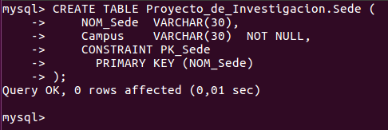

#### CREACIÓN TABLA DEPARTAMENTO - (PROYECTO DE INVESTIGACIÓN)

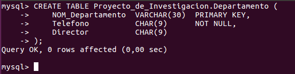

#### CREACIÓN TABLA UBICACIÓN - (PROYECTO DE INVESTIGACIÓN)

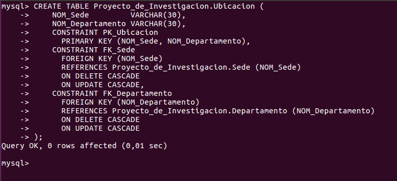

👁 [ÍNDICE](#sql-bbdd_index)

#### CREACIÓN TABLA GRUPO - (PROYECTO DE INVESTIGACIÓN)

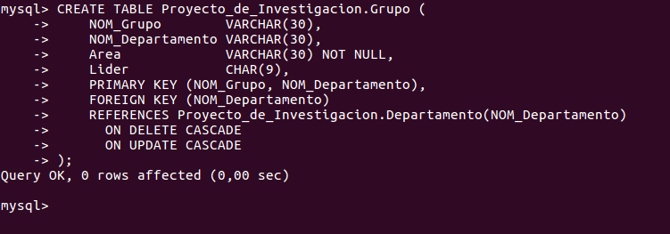

#### CREACIÓN TABLA PROFESOR - (PROYECTO DE INVESTIGACIÓN)

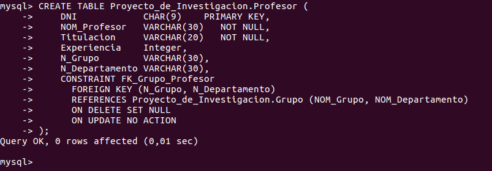

#### CREACIÓN TABLA PROYECTO - (PROYECTO DE INVESTIGACIÓN)

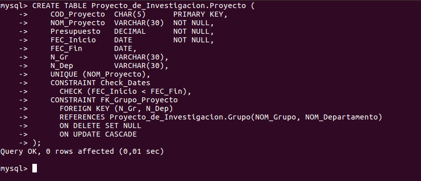

👁 [ÍNDICE](#sql-bbdd_index)

#### MODIFICACIÓN TABLA DEPARTAMENTO - (PROYECTO DE INVESTIGACIÓN)

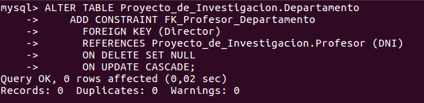

#### MODIFICACIÓN TABLA GRUPO - (PROYECTO DE INVESTIGACIÓN)

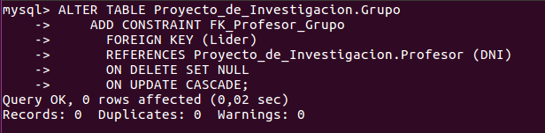

#### CREACIÓN TABLA PARTICIPA - (PROYECTO DE INVESTIGACIÓN)

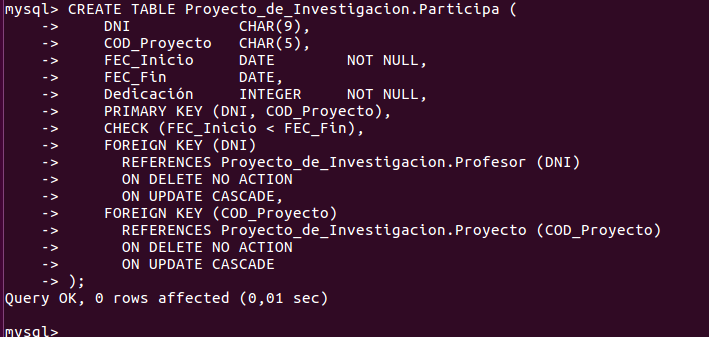

#### CREACIÓN TABLA PROGRAMA - (PROYECTO DE INVESTIGACIÓN)

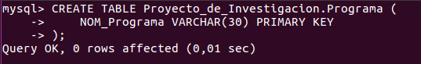

#### CREACIÓN TABLA FINANCIA - (PROYECTO DE INVESTIGACIÓN)

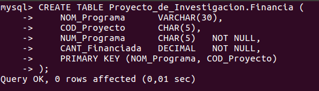

#### MODIFICACIÓN TABLA FINANCIA_1 - (PROYECTO DE INVESTIGACIÓN)

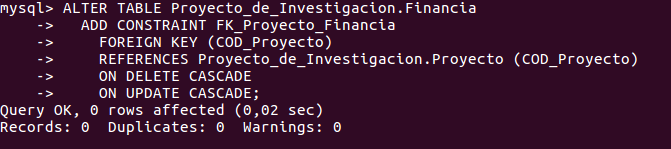

#### MODIFICACIÓN TABLA FINANCIA_2 - (PROYECTO DE INVESTIGACIÓN)

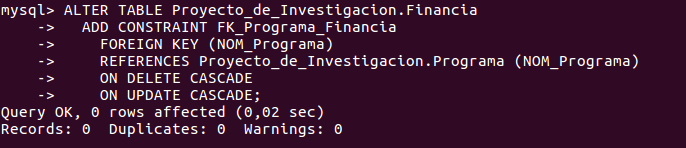

### RESULTADO [MUESTRA DE TABLAS] - (PROYECTO DE INVESTIGACIÓN)
Si queremos ver las tablas...

```sql
SHOW TABLES;
```
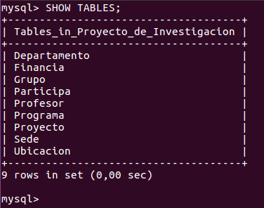

Ya que vimos como se creaban las tablas, ahora detallaremos, como mostrar alguna que otra tabla, de manera detallada...

Para ello escribiremos 👇

```sql
DESC Departamento;
```

  > La opción `DESC` también se conoce como la opción `DESCRIBE` (la cual detalla cualquier tabla que seleccionemos...)
  > Está opción, la usaremos más a fondo, cuando vayamos a crear, la base de datos, "Naves Espaciales".
  
👁 [ÍNDICE](#sql-bbdd_index)  


## CREACIÓN BBDD - NAVES ESPACIALES [AUTOMÁTICO] <a name="sql_naves-espaciales"></a>

Para el ejercicio de 'Naves Espaciales', crearemos la BBDD de manera automática (mediante importación), mostrando cada tabla, con el comando `DESC`.

[CÓDIGO de *Naves Espaciales* (GIST)](https://gist.github.com/christiancf9/b626d47f2b6bf05e708cc083449e0c0c)

Escribiremos lo siguiente para importar código (Depende de nuestra situación):

Fuera de MySQL
```console
christian@christian-VirtualBox:~$ sudo mysql -u root -p < /home/christian/Documentos/BBDD/Naves_Espaciales.sql
```
Dentro de MySQL
```sql
source /home/christian/Documentos/BBDD/Naves_Espaciales.sql;
```
En nuestro caso, al estar "dentro", seleccionaremos la 2º opción


Ahora seleccionamos la BBDD importada.. 
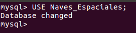

```sql
USE NAVES_ESPACIALES;
```
Mostramos (como hicimos con Proyecto de Investigación) sus respectivas tablas...

```sql
SHOW TABLES;
```


👁 [ÍNDICE](#sql-bbdd_index)

### RESULTADO [MUESTRA DE TABLAS] - (NAVES ESPACIALES)
Mostraremos info de cada una...

#### DESCRIPCIÓN TABLA CAMARA - (NAVES ESPACIALES)
Escribiremos 👇

```sql
DESC Camara;
```
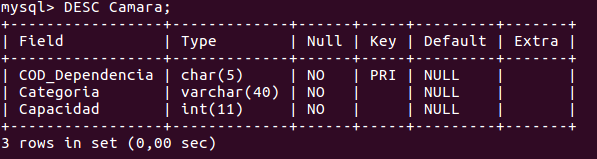

#### DESCRIPCIÓN TABLA DEPENDENCIA - (NAVES ESPACIALES)

```sql
DESC Dependencia;
```
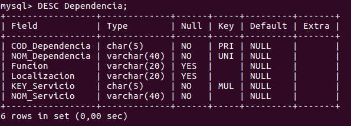

#### DESCRIPCIÓN TABLA HABITA - (NAVES ESPACIALES)

```sql
DESC Habita;
```
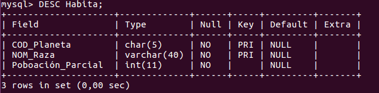

#### DESCRIPCIÓN TABLA PLANETA - (NAVES ESPACIALES)

```sql
DESC Planeta;
```
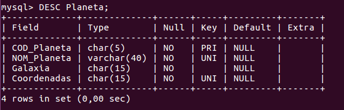

#### DESCRIPCIÓN TABLA RAZA - (NAVES ESPACIALES)

```sql
DESC Raza;
```
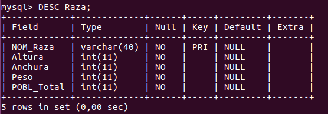

👁 [ÍNDICE](#sql-bbdd_index)

#### DESCRIPCIÓN TABLA SERVICIO - (NAVES ESPACIALES)

```sql
DESC Servicio;
```
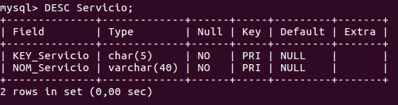

#### DESCRIPCIÓN TABLA TRIPULACIÓN - (NAVES ESPACIALES)

```sql
DESC Tripulacion;
```
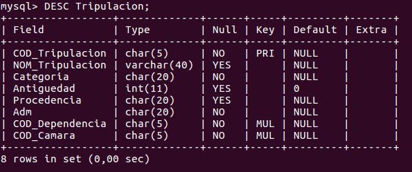

#### DESCRIPCIÓN TABLA VISITA - (NAVES ESPACIALES)

```sql
DESC Visita;
```
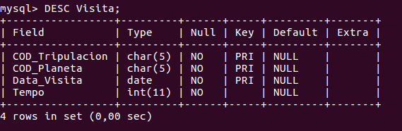

👁 [ÍNDICE](#sql-bbdd_index)

